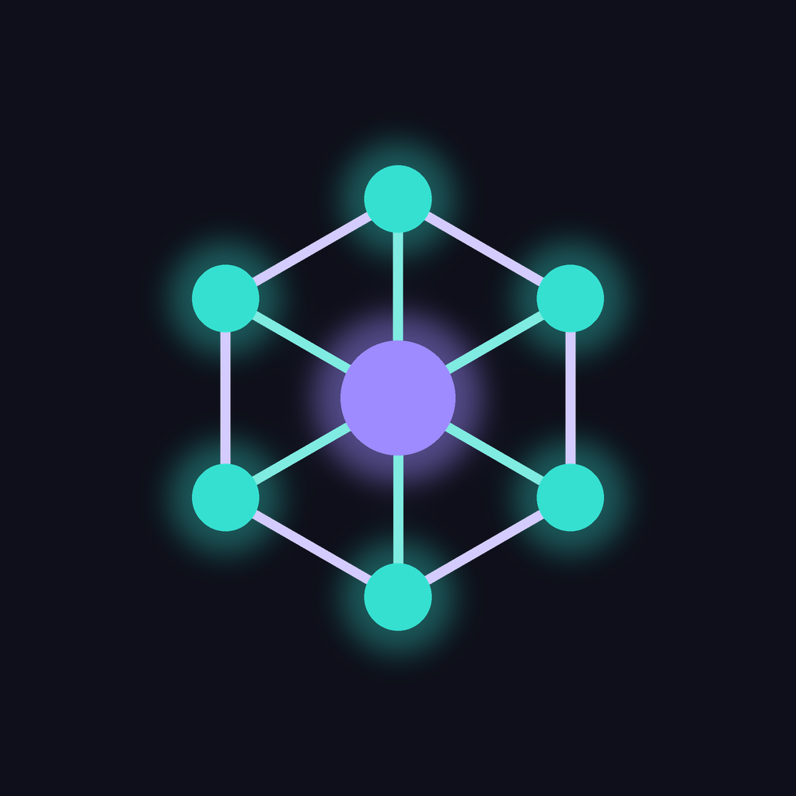

<p align="center">
  
</p>

# Lattice Clients

Cross-platform client applications for the **[Lattice](https://github.com/imcmurray/lattice)
peer-to-peer framework** — a security-forward, 100% Rust, post-quantum-hybrid P2P
stack (the Holepunch/Keet model, redesigned). One Flutter codebase targets
Android, Apple (iOS/macOS), Windows, and Arch Linux (Flutter's Linux desktop).

> **Status: experimental · unaudited.** Working on **Android** and **Linux desktop**
> today. Validated end-to-end on a real device: two nodes complete a post-quantum
> hybrid handshake over the iroh relay path and exchange an encrypted message.

## Built on Lattice

This project is a **client** — it does not implement any cryptography or transport
itself. All of that lives in the [**Lattice framework**](https://github.com/imcmurray/lattice):
PQ-hybrid identity (Ed25519+ML-DSA, X25519+ML-KEM) with BIP39 recovery, a BLAKE3
signed log, a hybrid-KEM + Double-Ratchet secure channel, and an iroh QUIC
transport with relay + hole-punching. These clients are a Flutter UI over that
audited core, bridged with [`flutter_rust_bridge`](https://github.com/fzyzcjy/flutter_rust_bridge).

```
Flutter UI (Dart, Material 3)
        │  flutter_rust_bridge v2 (async fns + event Stream)
        ▼
flutter/rust/lattice-mobile     FFI-safe facade (LatticeNode + NodeEvent)
        │  path dependency
        ▼
../Lattice/crates/lattice       the Lattice framework (PQ-hybrid · Double-Ratchet · iroh)
```

`lattice-mobile` exists because Flutter can't bridge Lattice's generic
`ConnectedSession<C>` / async traits directly. It exposes one concrete
`LatticeNode` that owns a tokio runtime, the iroh transport (bound lazily), and
the live peer sessions, and emits a `NodeEvent` stream the UI subscribes to. Its
wire preamble matches Lattice's `lattice-net` reference CLI, so the app
interoperates with it.

## First client: Lattice Node (control harness)

A polished developer/operator harness that exercises every seam of the framework:

- **Secure identity** — generate or recover a PQ-hybrid identity; the BIP39
  mnemonic is age-encrypted at rest, its passphrase held in the platform keystore
  (`flutter_secure_storage`) behind a biometric / device-credential gate
  (`local_auth`), with graceful fallback where biometrics aren't available.
- **Onboarding** — generate (reveal + confirm) or recover from a phrase.
- **Instrument-panel dashboard** — fingerprint + copyable PeerId, an ONLINE power
  toggle (binds iroh + accepts), a connect ticket as QR / scan / share / copy, live
  event console, and a per-peer encrypted send bar. Dark, mono crypto readouts,
  with a live lattice-mesh that pulses teal when the node is online.
- **Session resume + auto-reconnect** — a dropped link is re-dialed with the
  ratchet preserved (Lattice's `ConnectedSession::resume`); it falls back to a
  fresh handshake if the peer can't resume, with exponential backoff while
  unreachable. Resume/reconnect events show in the console.
- **Per-peer link health** — each connected peer shows a live chip: direct
  (teal) vs relayed (amber), plus round-trip time, polled from the selected
  iroh path.

## Requirements

- The **Lattice framework** checked out as a sibling directory, so the path
  dependency resolves:
  ```
  Development/
  ├── Lattice/           # github.com/imcmurray/lattice
  └── Lattice-Clients/   # this repo
  ```
- Flutter 3.44+, Rust (stable), and for Android: the SDK/NDK, the Rust Android
  targets, `cargo-ndk`, and `flutter_rust_bridge_codegen`. See
  [`docs/toolchain-setup.md`](docs/toolchain-setup.md).

## Build & run

```bash
cd flutter
flutter run -d linux                  # Linux desktop
flutter run -d <android-device>       # phone — builds per-ABI .so via cargo-ndk
flutter build apk --release --target-platform android-arm64   # sideloadable APK
```

If you change the Rust API, regenerate bindings:
`flutter_rust_bridge_codegen generate && dart run build_runner build`.

See [`docs/m2-testing.md`](docs/m2-testing.md) for the two-node test procedure.

## Notes

- **Compact ticket:** rather than embed the full PQ public-key bundle (~26 KB, far
  past a QR's ceiling), the ticket carries only the iroh address + the 32-byte
  PeerId. Since `PeerId = BLAKE3(all public keys)`, the dialer fetches the keys
  over the wire and verifies they hash to that PeerId — same security, but small
  enough for a **single QR + camera scan**. (Wire protocol differs from the
  `lattice-net` CLI as a result.)
- Building for Android with Gradle 9 required patching the vendored cargokit to use
  the injected `ExecOperations` service (Gradle 9 removed `Project.exec()`).
- The **direct-vs-relay** chip reads iroh 1.0.1's *selected* path (`is_ip` vs
  `is_relay`) rather than a removed top-level "connection type" — it reflects the
  actual data path and updates when a relay link upgrades to a direct one.

## Acknowledgements

- [**Lattice**](https://github.com/imcmurray/lattice) — the P2P framework this is built on.
- [**flutter_rust_bridge**](https://github.com/fzyzcjy/flutter_rust_bridge) — Dart ⇄ Rust FFI.
- [**iroh**](https://github.com/n0-computer/iroh) (n0) — QUIC transport, relays, hole-punching (via Lattice).

## License

[MIT](./LICENSE) © 2026 Ian McMurray.
